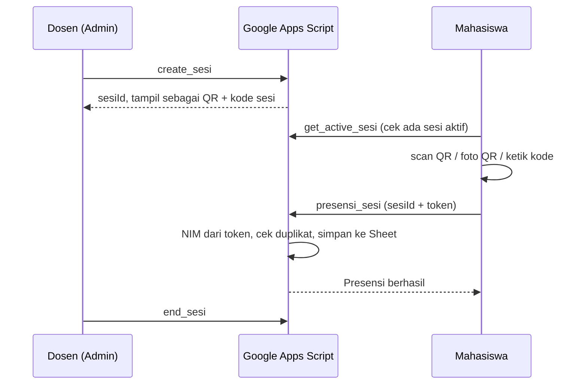

# PresensiKu

# 📲 Sistem Presensi Mahasiswa QR Code

Aplikasi web presensi kelas berbasis **QR Code**. Dosen membuka sesi presensi dan menampilkan QR di layar, mahasiswa memindai QR itu dari HP, dan kehadiran langsung tercatat di Google Sheets. Tanpa server sendiri: frontend di GitHub Pages, backend di Google Apps Script.


> 🔗 **Demo:** `https://<username>.github.io/<nama-repo>/`

---

## ✨ Fitur

### 👩‍🏫 Dosen / Admin
- Login dengan akun admin
- Buka dan tutup **sesi presensi** (satu sesi aktif dalam satu waktu)
- **QR sesi** otomatis + **kode sesi** tertulis di bawahnya (untuk mahasiswa yang kameranya bermasalah)
- Timer durasi sesi dan daftar hadir yang diperbarui otomatis
- Statistik dashboard: total mahasiswa, hadir, belum hadir, persentase kehadiran
- Grafik tren kehadiran dan rekap per mahasiswa

### 🎓 Mahasiswa
- Daftar akun memakai NIM yang sudah terdaftar, lalu login
- Presensi dengan **3 cara**: scan QR lewat kamera, foto QR memakai kamera bawaan HP, atau ketik kode sesi manual
- Status kehadiran hari ini dan **riwayat presensi**
- QR identitas pribadi dan halaman profil

### 🔐 Keamanan
- Password disimpan sebagai hash **HMAC-SHA256** (kunci rahasia di Script Properties, tidak pernah dikirim ke browser)
- Login memakai **token** yang berlaku 8 jam
- **NIM diambil dari token**, bukan dari data yang dikirim browser, sehingga mahasiswa tidak bisa presensi atas nama orang lain
- Setiap endpoint diperiksa perannya (admin / mahasiswa)
- Presensi ganda di hari yang sama ditolak

---

## 🧭 Cara Kerja



---

## 🧱 Teknologi

| Bagian | Yang dipakai |
|---|---|
| Frontend | HTML, CSS, JavaScript murni (tanpa framework / build tool) |
| Backend | Google Apps Script (Web App) |
| Database | Google Sheets |
| Scan QR | [html5-qrcode](https://github.com/mebjas/html5-qrcode) 2.3.8 |
| Pembuat QR | [api.qrserver.com](https://goqr.me/api/) |
| Grafik | [Chart.js](https://www.chartjs.org/) 4.4.4 |
| Ikon & font | Font Awesome 6.5.1, Plus Jakarta Sans |
| Hosting | GitHub Pages |

---

## 📁 Struktur Proyek

```
.
├── index.html              # Halaman awal
├── login.html              # Login & daftar akun
├── admin.html              # Dashboard dosen
├── admin.js
├── mahasiswa.html          # Dashboard mahasiswa
├── mahasiswa.js
├── auth.js                 # Koneksi ke backend, sesi login, helper API
├── avatars.js              # Avatar mahasiswa
├── daftar-mahasiswa.js     # Data pendukung daftar mahasiswa
├── style.css               # Gaya tampilan
└── backend/
    └── Code.gs             # Salinan kode Google Apps Script (disarankan disimpan di repo)
```

---

## 🗄️ Struktur Google Sheets

Buat satu spreadsheet dengan sheet berikut. Sheet `Akun`, `Sesi`, dan `Presensi` dibuat otomatis oleh `setupAdmin()`, sedangkan **`Mahasiswa` harus kamu isi sendiri**.

| Sheet | Kolom (urutan header) |
|---|---|
| `Mahasiswa` | NIM, Nama, Kelas, Jurusan |
| `Presensi` | Tanggal, Waktu, NIM, Nama, Kelas, Jurusan, Mata Kuliah, Status |
| `Akun` | Email, PasswordHash, Role, NIM, Nama, Token, TokenExpiry |
| `Sesi` | SesiID, Tanggal, WaktuDibuat, MataKuliah, Dosen, Status, WaktuSelesai |

---

## 🚀 Cara Instalasi

### 1. Siapkan Google Sheets
1. Buat spreadsheet baru di Google Drive.
2. Buat sheet bernama **`Mahasiswa`** dengan header `NIM, Nama, Kelas, Jurusan`, lalu isi data mahasiswa.

### 2. Pasang backend (Google Apps Script)
1. Di spreadsheet: **Extensions → Apps Script**.
2. Hapus isi bawaan, lalu tempel seluruh isi `backend/Code.gs`.
3. Ubah konstanta `MATA_KULIAH` (dan `TIMEZONE` bila perlu) di bagian atas file.
4. Pilih fungsi **`setupAdmin`** lalu klik **Run** satu kali dan setujui izin yang diminta. Fungsi ini membuat sheet yang dibutuhkan, kunci rahasia hash, dan akun admin awal.
5. **Deploy → New deployment → Web app**
   - *Execute as:* **Me**
   - *Who has access:* **Anyone**
6. Salin **URL Web App** (berakhiran `/exec`).

### 3. Hubungkan frontend
Buka `auth.js`, lalu ganti isi `WEB_APP_URL` dengan URL dari langkah sebelumnya:

```js
const WEB_APP_URL = 'https://script.google.com/macros/s/XXXXXXXX/exec';
```

### 4. Publikasikan di GitHub Pages
1. Upload semua file ke repository GitHub.
2. **Settings → Pages → Branch: `main` / root → Save**.
3. Buka `https://<username>.github.io/<nama-repo>/`.

> ⚠️ **Akun admin awal** dibuat oleh `setupAdmin()` (lihat kredensialnya di fungsi tersebut). **Segera ganti password-nya** setelah login pertama.

> 🔁 **Setiap kali `Code.gs` diubah**, deploy ulang: **Deploy → Manage deployments → ikon pensil → Version: New version → Deploy**. Kalau hanya disimpan tanpa deploy ulang, perubahan tidak berlaku.

---

## 📖 Cara Pakai

**Dosen**
1. Login → di dashboard klik buka sesi presensi.
2. Tampilkan QR (atau bagikan kode sesi) ke kelas. Perbesar layar bila QR terasa kecil.
3. Pantau daftar hadir langsung, lalu **Tutup Sesi** setelah selesai.

**Mahasiswa**
1. Daftar memakai NIM yang terdaftar, lalu login.
2. Saat sesi dibuka, tekan **Scan QR Sesi Sekarang** dan arahkan HP ke QR (jarak sekitar 20–30 cm).
3. Kamera bermasalah? Pakai **Foto QR pakai kamera HP**, atau **ketik kode sesi** yang tampil di layar dosen.

---

## 🔌 Endpoint API (Apps Script)

Semua endpoint lewat satu URL Web App. Aksi dikirim lewat parameter `action`.

| Metode | Action | Akses | Fungsi |
|---|---|---|---|
| POST | `login`, `signup`, `logout` | Publik / token | Autentikasi |
| GET | `verify_token` | Token | Cek login saat halaman dimuat ulang |
| GET | `get_active_sesi` | Login | Ambil sesi yang sedang aktif |
| POST | `create_sesi` | Admin | Buka sesi presensi |
| POST | `end_sesi` | Admin | Tutup sesi presensi |
| POST | `presensi_sesi` | Mahasiswa | Catat kehadiran (sesiId + token) |
| GET | `get_student`, `get_student_attendance` | Mahasiswa (data sendiri) / Admin | Data dan riwayat mahasiswa |
| GET | `get_all_attendance`, `get_sesi_attendance`, `get_dashboard_stats` | Admin | Rekap dan statistik |

---

## 🛠️ Pemecahan Masalah

| Gejala | Penyebab & solusi |
|---|---|
| Tampil tanggal **"Sat Dec 30 1899"** | Backend belum memakai `Code.gs` terbaru atau belum di-deploy ulang. Deploy versi baru. |
| Semua orang harus login ulang setelah ganti backend | Normal. Token lama tidak dikenal oleh backend baru. |
| Kamera tidak mau menyala | Pastikan situs dibuka lewat **HTTPS**, izin kamera di browser diizinkan, dan tidak ada aplikasi lain yang sedang memakai kamera. |
| QR tidak terbaca | Jaga jarak 20–30 cm, perbesar QR di layar dosen, naikkan kecerahan layar. Alternatif: tombol **Foto QR** atau ketik kode sesi. |
| Tutup sesi tidak berubah di tampilan | Muat ulang dengan Ctrl+Shift+R agar file lama dari cache tidak terpakai. |
| Terasa lambat | Apps Script punya jeda "bangun" setelah lama tidak dipakai (cold start). Request pertama bisa memakan beberapa detik. |

---

## ⚠️ Keterbatasan yang Diketahui

- **ID sesi bisa dilihat semua mahasiswa yang login** (lewat `get_active_sesi`), jadi QR bukan bukti kehadiran fisik yang kuat. Untuk pengamanan lebih ketat, pertimbangkan kode sesi yang berganti berkala (QR dinamis) atau pembatasan lokasi.
- Backend memakai Google Apps Script, sehingga terkena **kuota harian** dan latensi bawaan Google.
- Frontend memakai pustaka dari CDN, jadi butuh koneksi internet saat dibuka.

---

## 🗺️ Rencana Pengembangan

- [ ] QR dinamis yang berganti tiap beberapa detik
- [ ] Ekspor rekap presensi ke Excel / PDF
- [ ] Dukungan beberapa mata kuliah dan kelas
- [ ] Ubah dan reset password dari dalam aplikasi

---

## 📸 Tampilan

> Tambahkan screenshot di folder `docs/` lalu tampilkan di sini:
>
> `` &nbsp; ``

---

## 👤 Pembuat

**[Nama Kamu]** — [@username-github](https://github.com/username-github)

## 📄 Lisensi

Proyek ini dibuat untuk keperluan pembelajaran. Tentukan lisensi sesuai kebutuhan (mis. [MIT](https://choosealicense.com/licenses/mit/)).
